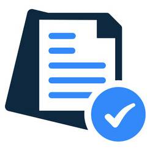

# Resume website
>
> Bringing all my knowledge and experiences in a single place.

Currently live at: https://gam-resume-site.vercel.app/

  

I will not go into detail because the project is very simple.

Here are some notworthy features:
---

### Themes
The front end features a combination of light and dark theme + an accent color.
This is achieved using css variables and using them within tailwind.

### Multible languages
The `i18n.js` file I have created offers 2 ways of translating strings:
- **Function:** Simply passing the string to a function
- **Dirrective:** Using svelte's unique directive feature, I can simply `use:i18n` and the contents of the element will be translated

All translations are in a `translations.json`. I prefer to see what is being translated so I made the whole sentances the keys, instead of using locator strings like "body.skills.js".
This also provides a nice fallback for any strings I have not translated.

### Persisted Store
Im sure I could have written this myself but I wanted to focus on the content instead so instead I used [svelte-persisted-store](https://github.com/joshnuss/svelte-persisted-store).
This allows me to save the site settings to the brouser so things like language, themes and colors can stay the way the user configures them even after closing the website.

---

I use [bun](https://bun.sh/) btw :)
